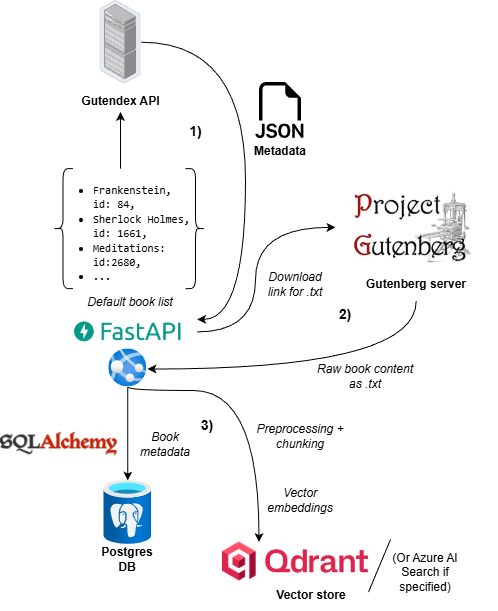
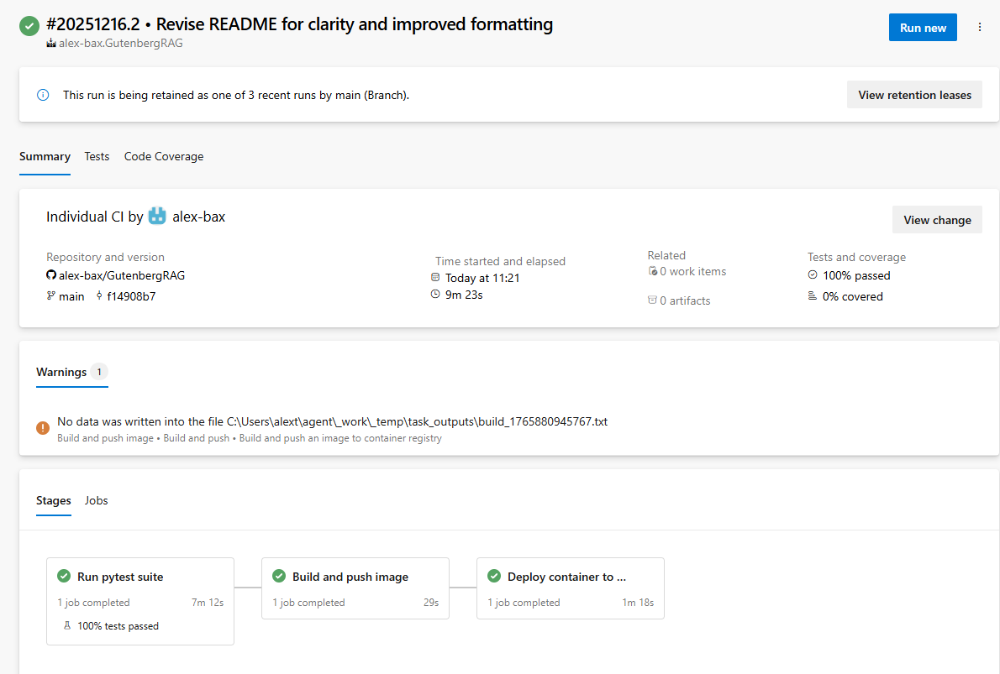
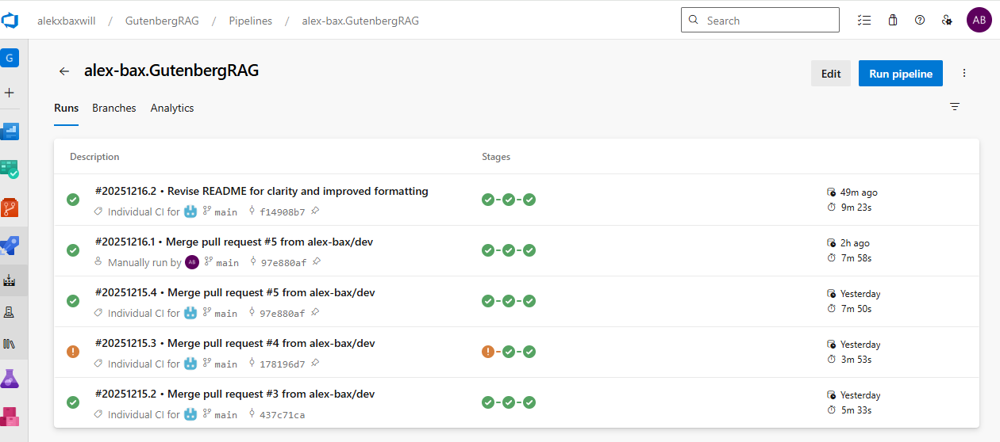

# 📖 Gutenberg RAG 

An end-to-end Retrieval-Augmented Generation system that embeds, indexes, and queries books from [Project Gutenberg](https://www.gutenberg.org/). \
Try out the [API here](https://gbragfastapi-accyhah2evcnfxev.westeurope-01.azurewebsites.net/docs)  *(NB - Work in progress)*

It’s designed to be production-ready and showcase modern vector search, advanced chunking strategies, proper evaluation, structured experiments and monitoring techniques.

## Features
### RAG
* Semantic search with embeddings using Qdrant
* Automatic book ingestion pipeline with text cleaning + chunking to either populate or upload books from Gutenberg
* Fast embeddings via Azure OpenAI (text-embedding-3-small)
* RAG response generation using Azure OpenAI GPT models
* LLM-based reranking 
* Evaluation with DeepEval using RAG relevant metrics:
     * Answer generation metrics: *Answer relevancy*, *Faithfulness*
     * Retrieval metrics: *Context relevance*, *Context precision*
     * Golden answer datasets with varying complexity and to measure hallucinations with trick questions
 * Structured outputs with Pydantic classes

### Architecture
- Backend: FastAPI in Azure Web App service
- Storage:
    - Async PostgreSQL DB hosted on Supabase (book metadata such as title, authors, language, etc.)
    - SQLAlchemy as ORM 
- Vector DB interface and implementation: **Qdrant** / **Azure AI Search**
- LLM: GPT-5-mini with Azure OpenAI 

### Ingestion 
For populating with the default booklist or user selected books \

### Retrieval 
...

#### API / Software 
* Interfaces for easily swapping vector databases, currently supporting Qdrant and Azure AI Search
* API uses paging for either book metadata or vector store, allowing for memory safe browsing
* Settings, secrets and hyperparameters are handled securely and neatly organised via a Pydantinc Settings singleton
* Built-in ratelimiter for ingestion pipeline, ensuring safely running large uploads on the embedding model
* Pydantic data classes for strong typing and intellisense

#### Production and deployment
* CI automated:
    * Integration and unit testing with PyTest (FastAPI + async DB)
    * Evaluation of the system using DeepEval + golden dataset
    * All steps must succeed in order to deploy ensuring quality
* CD pushing and deploying to Azure Container Registry and Docker 

#### Experiments
* All experiments are timed with a minimal custom timer
* Logs of the results and the hyperparameters are saved after each run
* Visualisation of experiment results
  

### Automatic deployment with Docker + CI/CD pipelines
For further details, the entire see `Dockerfile` and the CI/CD pipelines specified in `azure-pipelines.yml`

### Approach
...
 

## Planned features
#### RAG: Improving quality in retrieval
  * Experiment with better embedding model: Based on the [Hugging Face embedding leaderboard](https://huggingface.co/spaces/mteb/leaderboard) many better models are available. 
  * Semantic chunking:
    * Use dynamic chunk lengths depending the semantic context, ensuring that each chunk is as close as possible to having a single meaning, instead of many.
    * Add "who-what-where" sentence summary or similar to each chunk header with cheap/fast LLM. 
  * Hybrid search integrating with BM25 sparse vector algorithms.
  * Add halucination metric to evaluation suite
#### Production and increased safety
* Monitoring via [LangFuse](https://langfuse.com/), allowing for tracing the intermediate steps in the answer generation, prompt version control, metrics and even better evaluation.
* Guardrails to ensure that e.g. underage users wouldn't get inappropiate responses. Can be done directly in Azure Foundry, or custom made by adding input and output filters.
#### Other
* Parallelization of evaluation by using multiple threads to speed it up 
* Adding interface for embedding models
* Further API integration tests + test coverage on Azure Devops

### Experiments and findings *(Work in progress)*
... 

### Misc
- Hyperparameter json files used are prefixed by 'hp' and are found in the folder `config`.
- Golden datasets for evaluation are located in folder `evals/datasets`

**Contact** \
Alekxander Baxwill - alekx.baxwill@hotmail.com
