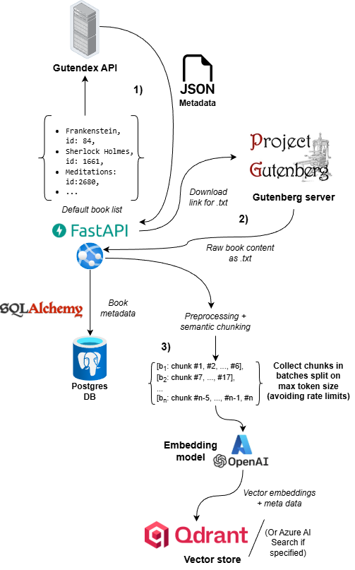
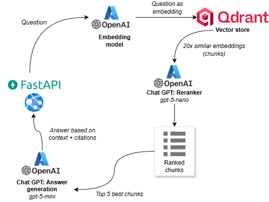

# 📖 Gutenberg RAG 

An end-to-end Retrieval-Augmented Generation system that embeds, indexes, and queries books from [Project Gutenberg](https://www.gutenberg.org/). \
Try out the [API here](https://gbragfastapi-accyhah2evcnfxev.westeurope-01.azurewebsites.net/docs) *(NB - Initial load can be slow due to cold booting of the container)*

It’s designed to be production-ready and showcase modern vector search, advanced chunking strategies, proper evaluation, structured experiments and monitoring techniques.

## Features
### RAG
* Semantic search with embeddings using Qdrant
* Semantic chunking, splitting chunks based on their meaning, instead of e.g. fixed lengths
* Automatic book ingestion pipeline with text cleaning + chunking to either populate or upload books from Gutenberg
* Fast embeddings via Azure OpenAI (text-embedding-3-small) with rate limiting
* RAG response generation using Azure OpenAI GPT models
* LLM-based reranking 
* Evaluation with DeepEval using RAG relevant metrics:
     * Answer generation metrics: *Answer relevancy*, *Faithfulness*
     * Retrieval metrics: *Context relevance*, *Context precision*
     * Golden answer datasets with varying complexity and to measure hallucinations with trick questions
 * Structured outputs with Pydantic classes

### Architecture
- Backend: FastAPI in Azure Web App service
- Storage:
    - Async PostgreSQL DB hosted on Supabase (book metadata such as title, authors, language, etc.)
    - SQLAlchemy as ORM 
- Vector DB interface and implementation: **Qdrant** / **Azure AI Search**
- LLM: GPT-5-mini with Azure OpenAI, using a custom made lenient guardrail filter on Azure Foundry 

### API / Software 
* Interfaces for easily swapping vector databases, currently supporting Qdrant and Azure AI Search
* API uses paging for either book metadata or vector store, allowing for memory safe browsing
* Settings, secrets and hyperparameters are handled securely and neatly organised via a Pydantinc Settings singleton
* Built-in ratelimiter for ingestion pipeline, ensuring safely running large uploads on the embedding model
* Pydantic data classes for strong typing and intellisense

### Production and deployment
* CI automated:
    * Integration and unit testing with PyTest (FastAPI + async DB)
    * Evaluation of the system using DeepEval + golden dataset
    * All steps must succeed in order to deploy ensuring quality
* CD pushing and deploying to Azure Container Registry and Docker 

### Experiment
* All experiments are timed with a minimal custom timer
* Logs of the results and the hyperparameters are saved after each run
* Visualisation of experiment results

**Vector DB config**

All vector collections use *HNSW* (graph-based approximate nearest neighbor) as vector search algorithm. Cosine distance is used to calculate the similarity, and uses a vector dimension of 1536 (requried by the embedding model `text-embedding-3-small`). Remaining configuration parameters can be found in the [Qdrant configuration file](config/qdrant_collection_config.json)

Additional metadata fields used:
```json
{
  "content": {
    "data_type": "text",
  },
  "uuid_str": {
    "data_type": "uuid",
  },
  "book_id": {
    "data_type": "integer",
  },
  "chunk_nr": {
    "data_type": "integer",
  },
  "book_name": {
    "data_type": "keyword",
  }
}
```

### Ingestion 
A default book list is used for populating the vector DB, however book(s) can also be ingested by calling the API on the route ``/query/`` with the list of Gutenberg IDs to upload and index.\
The default book list can be found under the attribute `default_ids_used` in the [configuration file](config/hp-sem-ch.json)


### Chunking
To ensure the quality of the retrieved context, 2 different approaches have been used: 
- Fixed size chunking
- Semantic sized chunking *(current)*

**Fixed size chunking** \
A simple but naive way to split up the book text. Here done by chunking by some hard defined length. \
In this case about every 500 characters with `\n` as separator and an overlap between the chunks of 100.
*Example of a fixed size chunk*


*Evaluation results*
TODO! ADD RESULT CHARTS - fixed size chunking

**Semantic sized chunking**\
Even with overlap between the chunks, context are easily lost when using fixed chunk sizes.\
With semantic chunking, chunks are split based on their meaning, in turn making each chunk more relevant.\
This produces chunks with varying lengths, and requires use of an embedding model while building the collection.\
This implementation uses a custom made splitter, with the [Semantic splitter by LlamaIndex](https://developers.llamaindex.ai/python/framework-api-reference/node_parsers/semantic_splitter/) as the base.

In brief, the splitter works roughly by:
1. Split the document into small base units (often sentences).
2. Make embedding of each sentences.
3. For every sentence, compute semantic dissimilarity between it and its adjacent sentence (using cosine distance).
4. Collect all these distances and make a distribution
4. Define a `cutoff` based on the distribution and the breakpoint percentile threshold parameter.
5. Loop over all sentences, and insert a breakpoint only when the dissimilarity is > `cutoff`.

Example of how the threshold is used:
Say we're given the sentences:
```markdown
S1: Holmes lit his pipe.
S2: He considered the evidence carefully.
S3: The fog lay thick over Baker Street.
S4: Meanwhile, in Paris, the minister resigned.
```
And their distances are
```markdown
S1–S2: 0.06
S2–S3: 0.08
S3–S4: 0.42   ← semantic jump
```
So if the cutoff is `0.3`:
* Sentences 1–3 → one chunk
* Sentence 4 → new chunk


TODO! Add collection fingerprint summary

Initially, I experimented with using the semantic splitter with its default parameters of 95 percentile dissimilarity as the break point threshold for splitting.  

It created better results than when using *fixed sized* chunking as seen here:
TODO! *ADD 95p breakpoint eval results*


However the distribution of the chunk lengths were very unenven, as seen in "Alice's Adventure in Wonderland" and "Frankenstein":


The disadvantages of having few but very long chunks are:
- Bias: longer chunks can dominate, since they are more "matchable" due their length.
- Cost/latency: With the reranker + generation over large contexts, it gets slower and more expensive.
- Answer quality drift: long chunks can make topics/meaning too "bland", increasing hallucination risk or making citations fuzzy.


Using 75% percentile dissimilarity yielded more balanced plots:\
!TODO ADD ALICE AND FRANKENSTEIN DISTR PLOTS

**Eval results**
!TODO ADD EVAL RESULTS WITH UPDATED BREAKPOINT!

**Summary of the semantic vector collection**
To better understand how the semantic splitting is applied, \
I make a summary of the collection that after building the vector index. 
It helps show how the chunk sizes are distributed. Here `std` is the standard deviation and `p` is the percentile, so `p90` is "90% percentile". 

TODO: redo this
| Metric                              | Value        |
|-------------------------------------|--------------|
| book_count                          | 2            |
| total_chunks                        | 4            |
| book_chunk_count_median             | 2.0          |
| book_chunk_count_p90                | 2.0          |
| book_token_mean_median              | 116.75       |
| book_token_mean_p90                 | 120.95       |
| book_token_std_median               | 45.6083873865|
| book_token_std_p90                  | 47.5882863739|
| book_token_max_median               | 149.0        |
| book_token_max_p90                  | 154.6        |
| chunk_token_p10                     | 83.1         |
| chunk_token_p50                     | 115.0        |
| chunk_token_p90                     | 151.8        |
| chunk_token_p99                     | 155.58       |
| pct_books_token_std_gt_p90          | 50.0         |
| pct_books_token_max_gt_2xp90        | 0.0          |
| pct_books_chunk_count_gt_p99        | 0.0          |

#### Comparison of Fixes size VS. Semantic sized chunking
*Experiments*


TODO: *Add notes on chunking strategy, batching for rate limiting*

### Vector collections and exploration
In Qdrant it's possible to explore 


### Retrieval 



### Automatic deployment with Docker + CI/CD pipelines
For further details, the entire see `Dockerfile` and the CI/CD pipelines specified in `azure-pipelines.yml`


### Experiments and findings *(Work in progress)*
One of the interesting challenges with works in long book form, is how they can be quite implicit and wordy, making such
sections i.e. chunks, harder to use for more explicit who-what-where questions. Or when the answer to a question requires *multi-hopping* combining multiple chunks located at different places in the work and jointly reasoning over them all.

For example in *Sherlock Holmes*, from the eval golden set `gb_gold_med.csv` the question *"Which character hires Holmes to investigate the strange advertisement seeking red-headed men?"* is non-trivial to answer for the system. 

*How semantic chunking fixes this* \
...

## 📋 Planned features
#### RAG: Improving quality in retrieval
  
  * Improved semantic context in chunking:
    * ~~Use dynamic chunk lengths depending the semantic context, ensuring that each chunk is as close as possible to having a single meaning, instead of many.~~
    * More context in chunks: Add "who-what-where" sentence summary or similar to each chunk header with cheap LLM. 
    * Experiment with other semantic chunkers such as *Statistical chunking* or *Cumulative Semantic chunking*
  * Experiment with better embedding models: Based on the [Hugging Face embedding leaderboard](https://huggingface.co/spaces/mteb/leaderboard) many better models are available.  
  * Hybrid search integrating with BM25 sparse vector algorithms.
  * Add halucination metric to evaluation suite
#### Production and increased safety
* Monitoring via [LangFuse](https://langfuse.com/), allowing for tracing the intermediate steps in the answer generation, prompt version control, metrics and even better evaluation.
* Guardrails to ensure that e.g. underage users wouldn't get inappropiate responses. Can be done directly in Azure Foundry, or custom made by adding input and output filters.
#### Other
* Parallelization of evaluation by using multiple threads to speed it up 
* Adding interface for embedding models to also make them easily swapable
* Further API integration tests + test coverage on Azure Devops


### Misc
- Hyperparameter json files used are prefixed by 'hp' and are found in the folder `config`.
- Golden datasets for evaluation are located in folder `evals/datasets`

____

**Contact** \
Alekxander Baxwill - alekx.baxwill@hotmail.com
