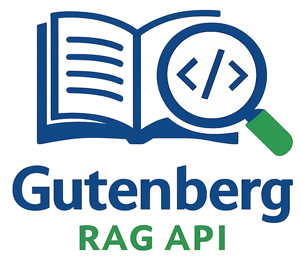
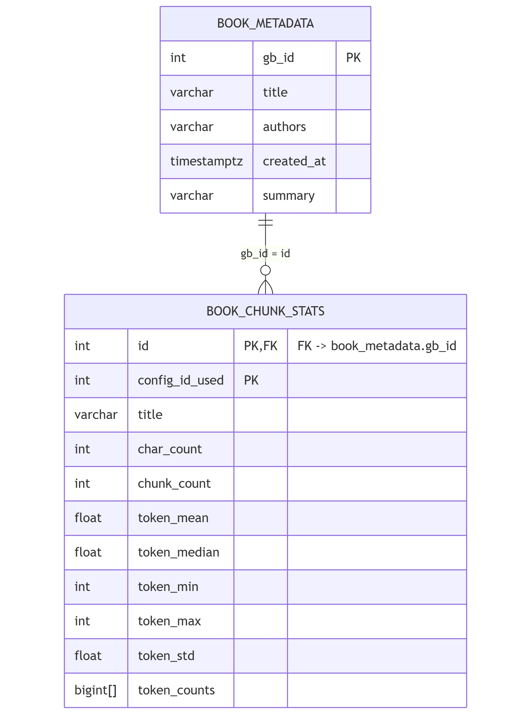

___

An end-to-end Retrieval-Augmented Generation system that embeds, indexes, and queries books from [Project Gutenberg](https://www.gutenberg.org/). \
See the OpenAPI specification and try out the API itself [here](https://gbragfastapi-accyhah2evcnfxev.westeurope-01.azurewebsites.net/docs) *(NB - Initial load can be slow due to cold booting of the container)*

It’s designed to be production-ready and showcase modern vector search, advanced chunking strategies, proper evaluation, structured experiments and monitoring techniques.

- The `/books/` route query the metadata Postgres DB, fetch metadata of books, either individually, in chunks through paginations or all books at a time. Addtionally `/books/gutenberg/` allows for exploring books in Project Gutenberg without leaving the API.
- The `/index/` route interacts with the vector index/collection. It allows for searching chunks from text, Delete and upload new books by just giving its Gutenberg ID, in turn using the **ingestion** pipeline.  
- The `/query/` route which uses the **retrieval** workflow to answer any text based query, with citations.  

## Features
### 🔍 RAG
* Semantic search with embeddings using Qdrant
* Semantic chunking, splitting chunks based on their meaning
* Automatic book ingestion pipeline with text preprocessing + chunking to either populate or upload books from Gutenberg
* Fast embeddings via Azure OpenAI (text-embedding-3-small) with rate limiting
* RAG response generation using Azure OpenAI GPT models
* LLM-based reranking 
* Structured outputs with Pydantic classes

### 🧱 Architecture
- Backend: FastAPI in Azure Web App service
- Storage:
    - Async PostgreSQL DB hosted on Supabase (book metadata such as title, authors, language, etc.)
    - SQLAlchemy as ORM 
- Vector DB interface and implementation: **Qdrant** / Azure AI Search
- LLM: GPT-5-mini with Azure OpenAI, using a custom lenient guardrail filter on Azure Foundry 

### ⚖️ LLM Evaluation
* Evaluation with DeepEval using RAG specific metrics:
     * **Answer generation metrics:**
        * *Answer relevancy* - Is the answer on-topic? Low score means vague/generic answer
        * *Faithfulness* - Is the answer supported by the retrieved context? And not made up by hallucination
     * **Retrieval metrics:** 
        * *Context relevance* - Was the right information retrieved for this question? High score is when context is directly related to the question, minimal noise, etc.
        * *Context precision* - How much of the retrieved context is actually useful? Low score would e.g. be if 5 out of 6 paragraphs retrieved were irrelevant 
* Golden datasets (found in `evals/datasets`) for concrete "who-what-where" questions and varying difficulty   

### 🛜 API / Software 
* Interfaces for easily swapping vector databases, currently supporting Qdrant and Azure AI Search
* API uses paging for either book metadata or vector store, allowing for memory safe browsing
* Settings, secrets and hyperparameters are handled securely and neatly organised via Pydantic Settings singleton
* Built-in ratelimiter for ingestion pipeline, ensuring safely running large uploads 
* Pydantic data classes for strong typing and intellisense

### 📦 Production and deployment
* CI automated:
    * Integration and unit testing with PyTest (FastAPI + async DB)
    * LLM evaluation using DeepEval + golden dataset
    * All steps must succeed in order to deploy 
* CD pushing and deploying to Azure Container Registry and Docker 

### 📈 Monitoring (Soon)
* Prometheus + Grafana

### 🔒 Simple Authentication (Soon)
* API key auth

___
### ℹ️ Links to more detailed documentation
- [Chunking and chunking experiments](docs/chunking.md)
- [Details on vector store](docs/vector_store.md)
- [Testing approach](docs/testing.md)

## Ingestion 
The ingestion pipeline is triggered when the API is booting up for the first time, to populate the vector collection *or* it's triggered when a user is uploading a single book. 

A default list of 10 different types of books/works are used for populating the vector DB, and be found under the attribute `default_ids_used` in the [configuration file](config/hp-sem-ch.json).

Populating the vector collection is a long running operation and requires a lot of calls to both the embedding model and the Qdrant client. In order to upload large and high volume of books smoothly without errors, **rate limiting** with *pyrate limiter* and **batching** has been implemented. 

In this latest version the rate limiter is used in the [semantic chunking](docs/chunking.md) step and the embedding of the chunks. Since the embedding model only accepts string (chunks) up to a certain size, all chunks are split into batches based on this "max token threshold" which all is specified in the [config files.](/config/hp-sem70p-ch.json)\
The entire ingestion pipeline is seen here:\

After populating the vector collection a statistics summary is made.\
You can find the latest the summmary produced and a brief explanation in the chunking docs [here](docs/chunking.md)

#### Database tables
The simple Entity-Relationship diagram depicts the tables used for storing both the \
**metadata of books** in the vector collection and their **chunking stats**:\

The `book_metadata` is being populated by the meta data from Gutenberg.\
The `book_chunk_stats` shows relevant stats related to how the individual book was chunked by the semantic chunker, and all these chunk stats gives insight into how the vector collection is distributed overall.

## Retrieval 

### Automatic testing and deployment with Docker + CI/CD pipelines
The pipelines are triggered whenever a new commit is pushed to *main* branch, usually after merging *dev* into it.\
The steps run are the following:
1. **Tests**
    * Integration test of the API, using an async in-memory SQLite DB and mock vector DB
    * Small unit test suite for the actual vector DB (Qdrant)
    * DeepEval tests, using the [CI golden set](evals/datasets/gb_ci_pipeline.csv)
2. **Build and push**
    * Build the image according to the steps in the Docker file
    * Push it to Azure Container Registry with a new tag
3. **Deploy to the Azure Web Service**
    * Pull the newly created image
    * Deploy it to the web service

Each step is dependent on the previous step succeeding.\
For further details, see the `Dockerfile` and the CI/CD pipelines specified in `azure-pipelines.yml`\

Screenshots from the CI/CD pipeline:

## 📋 Planned features
#### RAG: Improving quality in retrieval
  * Hybrid search integrating with BM25 sparse vector algorithms.
  * Improved semantic context in the chunks:
    * More context in chunks: Add "who-what-where" sentence summary or similar to each chunk header with cheap LLM. 
    * Experiment with other semantic chunkers such as *Statistical chunking* or *Cumulative Semantic chunking*
    * Graph RAG: Use knowlegde graphs to link relevant chunks together. Use this (GraphRAG library)[https://microsoft.github.io/graphrag/]
  * Experiment with better embedding models: Based on the [Hugging Face embedding leaderboard](https://huggingface.co/spaces/mteb/leaderboard) many better models are available.  
  * Add halucination metric to evaluation suite
#### Production and increased safety
* **System/API monitoring with Promethus and Grafana**
* **Simple API key as Auth**
* LLM monitoring via [LangFuse](https://langfuse.com/), allowing for tracing the intermediate steps in the answer generation, prompt version control, metrics and even better evaluation.
* Guardrails to ensure that e.g. underage users wouldn't get inappropiate responses. Can be done directly in Azure Foundry, or custom made by adding input and output filters.

### Other
* Adding interface for embedding models to also make them easily swapable
* Further API integration tests + test coverage on Azure Devops
* Refactor to use Clean Architecture

## Misc
- Hyperparameter json files used are prefixed by 'hp' and are found in the folder `config`.
- Golden datasets for evaluation are located in folder `evals/datasets`

____

**Contact** \
Alekxander Baxwill - alekx.baxwill@hotmail.com
