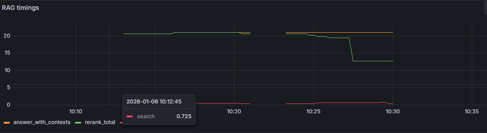
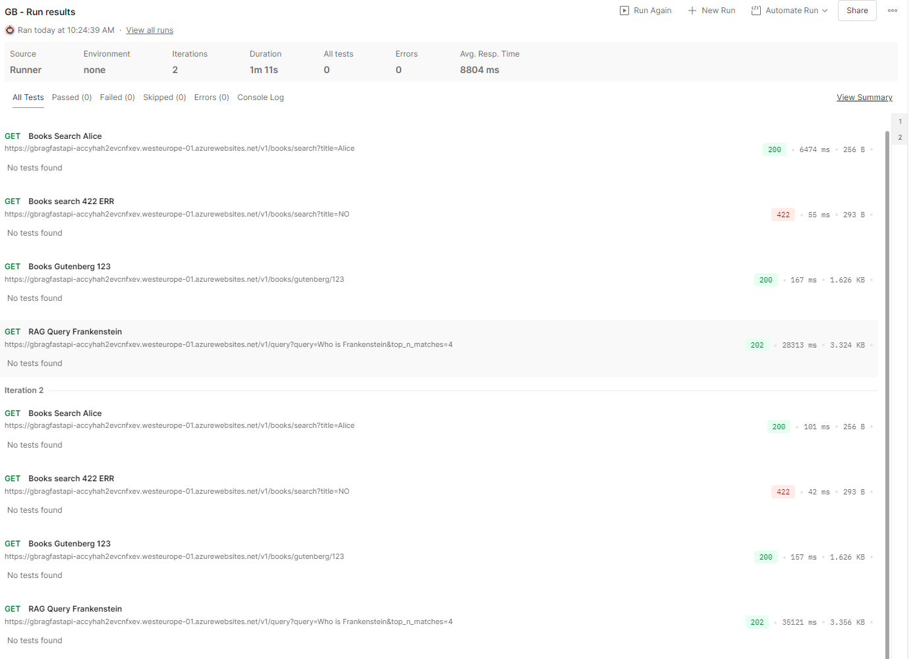
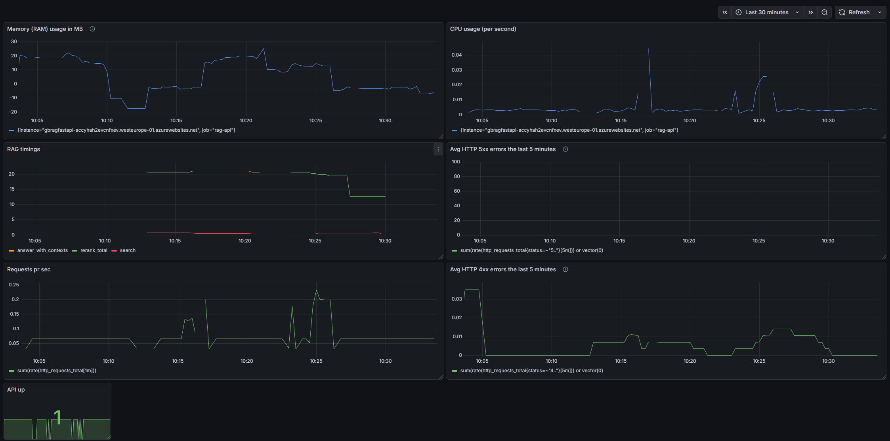

# API Monitoring 
Monitoring of the API is done with the commonly used industry tools [Prometheus](https://prometheus.io/) and [Grafana](https://grafana.com/).\
Where Prometheus is the monitoring and metrics service, saving its observations into its (for now) local time series database.\
Grafana is the observability platform used to display the Prometheus metrics into premade/custom dashboards. 

They are deployed in Azure with the following architecture:

\
ℹ️ See the `prometheus` and `grafana` folders for more deployment details with `.yml`.

## Metrics 
For efficiency [Prometheus FastAPI Instrumentator](https://github.com/trallnag/prometheus-fastapi-instrumentator) is used to expose many commonly used metrics, such as counters and histograms for `http_requests_total`, `http_request_duration_seconds` and HTTP status codes. 

While more could be done for custom metrics, I've made 3 that times the different stages of the RAG process:\
*context retrieval, reranking, answer generation*
In its Grafana dashoboard it's visualized as:

The y-axis is the time taken to perform one of three stages in seconds. The gaps are due the Grafana not showing down-time (when no calls are being made). The HTTP call made to test the RAG route:\
`https://gbragfastapi-accyhah2evcnfxev.westeurope-01.azurewebsites.net/v1/query?query=Who is Frankenstein&top_n_matches=10`

💡 It's clear from the green `rerank_total`, that the LLM re-ranker is very slow with ~20 secs. It'll worth to investigate faster reranking approaches

## Putting it all together - Custom dashboard

To see the dashboard in action, I've created a small functional test suite in Postman, with 2 iterations:
\
The 422 error is made on purpose to test the HTTP 400 visualization. The call is made with: `/v1/books/search?title=NO`. The `title` parameter is less than 2 characters, thus failing the minimum length requirement and triggering the 422 error.

From running the above test with Postman, it affected the dasboard like so:

* Blue visualizations are for monitoring API use of resources on the host, in this case the RAM usage and the number of CPUs used.\
* Green are tracking the total number of HTTP requests over 1 minute and the average number of HTTP 4XX and 5XX errors over the last 5 minutes.\
* "API Up" showing a 1, at the bottom, is displaying if the API is up and running or not.\

The dasboard shows activity in the last 30 minutes. 

### Performance test with Postman (Work in progress)
In order to test how the API handles high volume, I've made a "traffic simulation"/[performance test](https://learning.postman.com/docs/collections/performance-testing/performance-test-configuration/) with collection of Postman tests. It makes HTTP calls to different routes on the API, like so:
