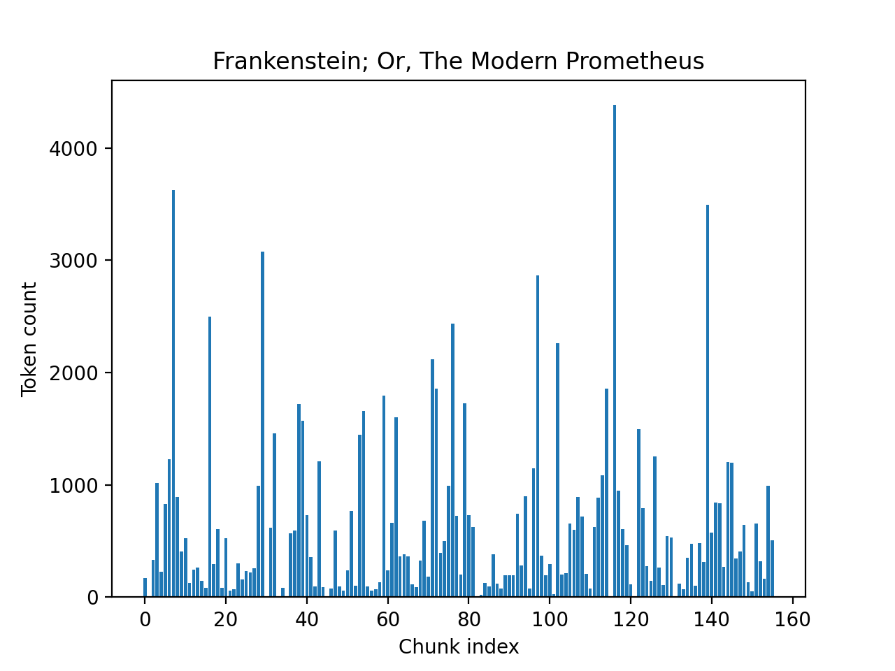

# Chunking
To ensure the quality of the retrieved context, 2 different approaches were experimented with: 
- Fixed size chunking
- Semantic sized chunking *(current)*

### Fixed size chunking
A simple but naive way to split up the book text. Here done as chunking the text by some hard defined length. \
In this case about every 500 characters with `\n` as separator and an overlap between the chunks of 100 to keep some context from the previous chunk.\
*Example of a fixed size chunk*\


**Evaluation results**\
Having plotted the scores from running the [CI golden set](../evals/datasets/gb_ci_pipeline.csv) with DeepEval, it's clear that the chunks retrieved had "varying" relevance.. *yikes*\


On the other hand answer generation went fine:\


From inspecting some of the test cases, we see that at e.g. index 7, with *Which musical instrument does Holmes play?*, the response was *"I dont know based on the given context"*.\
This is the default answer as instructed, when no relevant context was given. Checking the context chunks, it's indeed true, there were no mention of music or instruments.  

**NB:**\
*I've defined the threshold as 0.7, which is subjective. However from experience this was the quality that semeed satisfying*\
*The full evaluation output can be seen at the bottom, under `metricScores`* [here](../evals/3112-2025_1424/.latest_test_run.json)


### Semantic sized chunking
From the poor evaluation score, more work was needed on the retrieval.\
Even with overlap between the chunks, context are easily lost when using fixed chunk sizes.\
With semantic chunking, chunks are split based on their meaning, in turn making each chunk more relevant.\
This produces chunks with varying lengths, and requires use of an embedding model while building the collection.\
This implementation uses a custom made splitter, with the [Semantic splitter by LlamaIndex](https://developers.llamaindex.ai/python/framework-api-reference/node_parsers/semantic_splitter/) as the base.

In brief, the splitter works roughly by:
1. Split the document into small base units (often sentences).
2. Make embedding of each sentences.
3. For every sentence, compute semantic dissimilarity between it and its adjacent sentence (using cosine distance).
4. Collect all these distances and make a distribution
4. Define a `cutoff` based on the distribution and the breakpoint percentile threshold parameter.
5. Loop over all sentences, and insert a breakpoint only when the dissimilarity is > `cutoff`.

**Example of how the threshold is used:**\
Say we're given the sentences:
```markdown
S1: Holmes lit his pipe.
S2: He considered the evidence carefully.
S3: The fog lay thick over Baker Street.
S4: Meanwhile, in Paris, the minister resigned.
```
And their distances are
```markdown
S1–S2: 0.06
S2–S3: 0.08
S3–S4: 0.42   ← semantic jump
```
So if the cutoff is `0.3`:
* Sentences 1–3 → one chunk
* Sentence 4 → new chunk


TODO! Add collection fingerprint summary


However the distribution of the chunk lengths were very unenven, as seen in "Alice's Adventure in Wonderland" and "Frankenstein":\
 


Initially, I experimented with using the semantic splitter with its default parameters of 95 percentile dissimilarity as the break point threshold for splitting.  

The disadvantages of having few but very long chunks are:
- Bias: longer chunks can dominate, since they are more "matchable" due their length.
- Cost/latency: With the reranker + generation over large contexts, it gets slower and more expensive.
- Answer quality drift: long chunks can make topics/meaning too "bland", increasing hallucination risk or making 

Using 75% percentile dissimilarity yielded more balanced plots:\


**Summary of the semantic vector collection**\
To better understand how the semantic splitting is applied, \
I've made a summary of the collection that after building the vector index. 
It helps show how the chunk sizes are distributed. Here `std` is the standard deviation and `p` is the percentile, so `p90` is "90% percentile". 

Stat summary of the default 90 percentile threshold:
| Key                          |              Value |
| ---------------------------- | -----------------: |
| config_id_used               |                  2 |
| book_count                   |                 10 |
| total_chunks                 |               4204 |
| book_chunk_count_median      |              349.5 |
| book_chunk_count_p90         |  736.999           |
| book_token_mean_median       |   310.705          |
| book_token_mean_p90          |  378.724           |
| book_token_std_median        | 435.723            |
| book_token_std_p90           | 509.125            |
| book_token_max_median        |             2614.0 |
| book_token_max_p90           |  5053.799          |
| chunk_token_p10              |               11.0 |
| chunk_token_p50              |              151.0 |
| chunk_token_p90              |              815.0 |
| chunk_token_p99              |  2115.880          |
| pct_books_token_std_gt_p90   |               10.0 |
| pct_books_token_max_gt_2xp90 |                0.0 |
| pct_books_chunk_count_gt_p99 |               10.0 |

`stats\index_stats\conf_id_2_gb-semantic_31-12-2025_1718.json` 

!TODO! REDO THIS!!!
Stat summary of 70 percentile threshold:
| Key                          |              Value |
| ---------------------------- | -----------------: |
| config_id_used               |                  3 |
| book_count                   |                  2 |
| total_chunks                 |                632 |
| book_chunk_count_median      |              316.0 |
| book_chunk_count_p90         |              332.8 |
| book_token_mean_median       | 114.975            |
| book_token_mean_p90          | 124.028            |
| book_token_std_median        | 153.828            |
| book_token_std_p90           | 156.358            |
| book_token_max_median        |             1125.5 |
| book_token_max_p90           |             1151.5 |
| chunk_token_p10              |               13.0 |
| chunk_token_p50              |               60.0 |
| chunk_token_p90              | 310.399            |
| chunk_token_p99              |  737.10            |
| pct_books_token_std_gt_p90   |               50.0 |
| pct_books_token_max_gt_2xp90 |                0.0 |
| pct_books_chunk_count_gt_p99 |               50.0 |

Side by side;
| Metric                           | Config 3 | Config 2 |
| -------------------------------- | -------: | -------: |
| config_id_used                   |        3 |        2 |
| book_count                       |       10 |       10 |
| total_chunks                     |      632 |     4204 |
| book_chunk_count_median          |      316 |      350 |
| book_chunk_count_p90             |      333 |      737 |
| book_token_mean_median           |   114.98 |   310.71 |
| book_token_mean_p90              |   124.03 |   378.72 |
| book_token_std_median            |   153.83 |   435.72 |
| book_token_std_p90               |   156.36 |   509.13 |
| book_token_max_median            |     1126 |     2614 |
| book_token_max_p90               |     1152 |     5054 |
| chunk_token_p10                  |       13 |       11 |
| chunk_token_p50                  |       60 |      151 |
| chunk_token_p90                  |      310 |      815 |
| chunk_token_p99                  |      737 |     2116 |
| pct_books_token_std_gt_p90 (%)   |       50 |       10 |
| pct_books_token_max_gt_2xp90 (%) |        0 |        0 |
| pct_books_chunk_count_gt_p99 (%) |       50 |       10 |

sem (90p + 1 buffer size)
{
    "config_id_used": 3,
    "book_count": 10,
    "total_chunks": 4204,
    "book_chunk_count_median": 349.5,
    "book_chunk_count_p90": 736.9999999999999,
    "book_token_mean_median": 310.705800943433,
    "book_token_mean_p90": 378.7249700956938,
    "book_token_std_median": 435.72328450636087,
    "book_token_std_p90": 509.12576998406144,
    "book_token_max_median": 2614.0,
    "book_token_max_p90": 5053.799999999999,
    "chunk_token_p10": 11.0,
    "chunk_token_p50": 151.0,
    "chunk_token_p90": 815.0,
    "chunk_token_p99": 2115.880000000001,
    "pct_books_token_std_gt_p90": 10.0,
    "pct_books_token_max_gt_2xp90": 0.0,
    "pct_books_chunk_count_gt_p99": 10.0
}

sem70p + buff size 4
{
    "config_id_used": 4,
    "book_count": 10,
    "total_chunks": 12583,
    "book_chunk_count_median": 1045.0,
    "book_chunk_count_p90": 2207.8999999999996,
    "book_token_mean_median": 104.41832551797677,
    "book_token_mean_p90": 127.29654311789905,
    "book_token_std_median": 141.0035275978587,
    "book_token_std_p90": 190.90068382250644,
    "book_token_max_median": 1302.5,
    "book_token_max_p90": 1737.1,
    "chunk_token_p10": 9.0,
    "chunk_token_p50": 44.0,
    "chunk_token_p90": 278.0,
    "chunk_token_p99": 798.1800000000003,
    "pct_books_token_std_gt_p90": 10.0,
    "pct_books_token_max_gt_2xp90": 0.0,
    "pct_books_chunk_count_gt_p99": 10.0
}


### Further experiments and findings *(Work in progress)*
One of the interesting challenges with works in long book form, is how they can be quite implicit and wordy, making such
sections i.e. chunks, harder to use for more explicit who-what-where questions. Or when the answer to a question requires *multi-hopping* combining multiple chunks located at different places in the work and jointly reasoning over them all.

For example in *Sherlock Holmes*, from the eval golden set `gb_gold_med.csv` the question *"Which character hires Holmes to investigate the strange advertisement seeking red-headed men?"* is non-trivial to answer for the system. 

