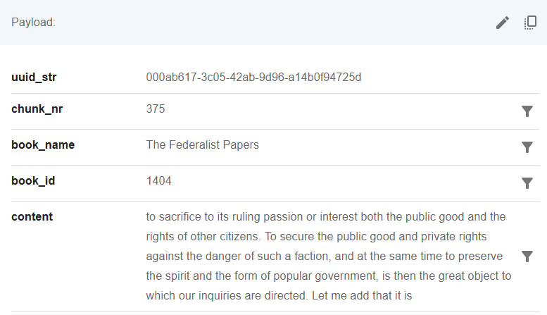
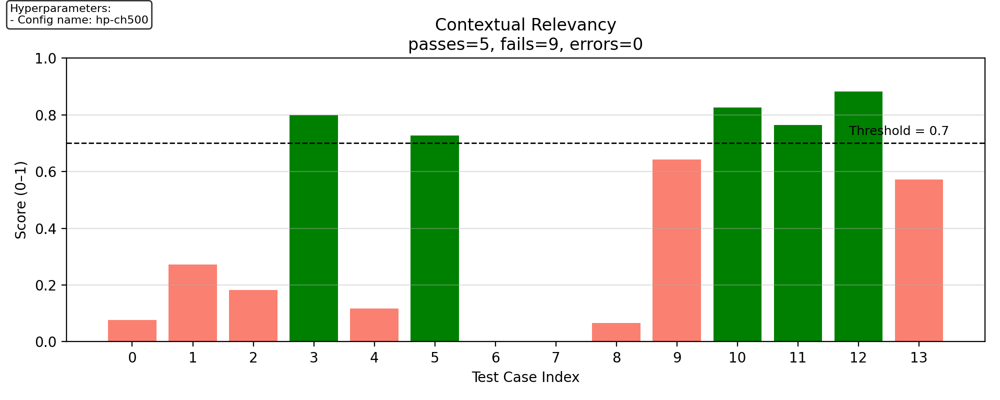
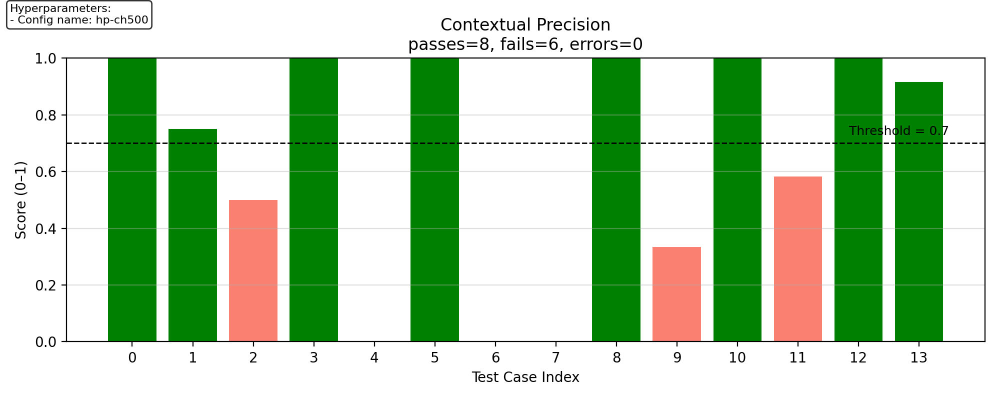
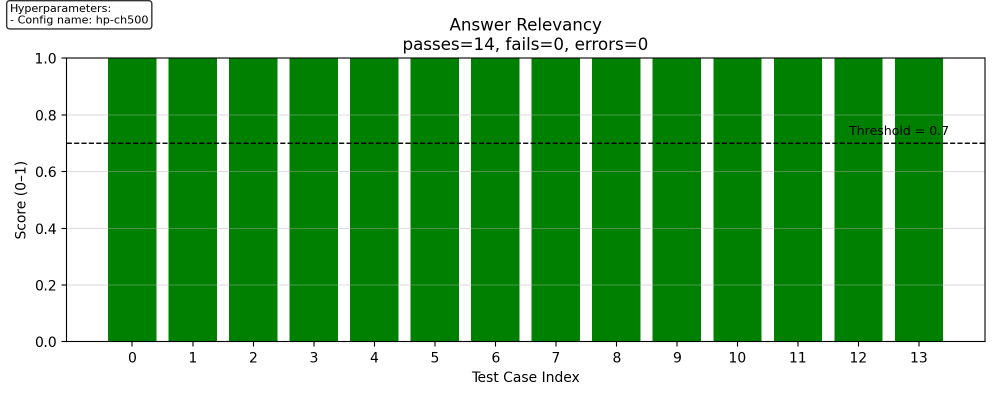
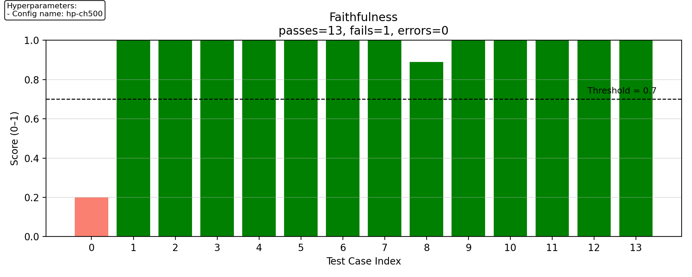
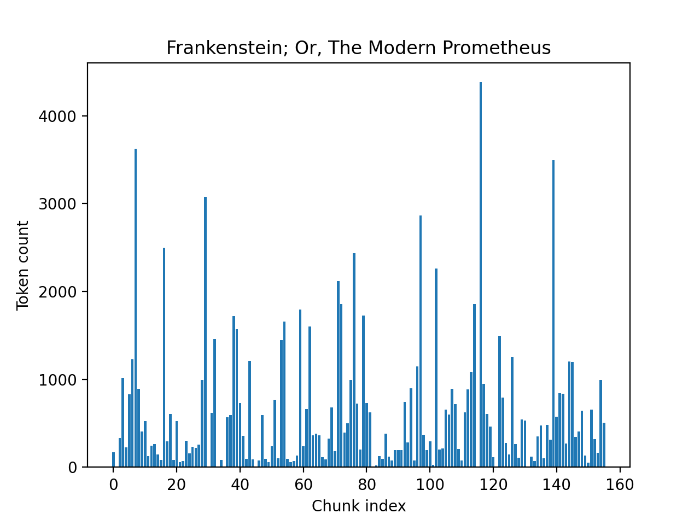
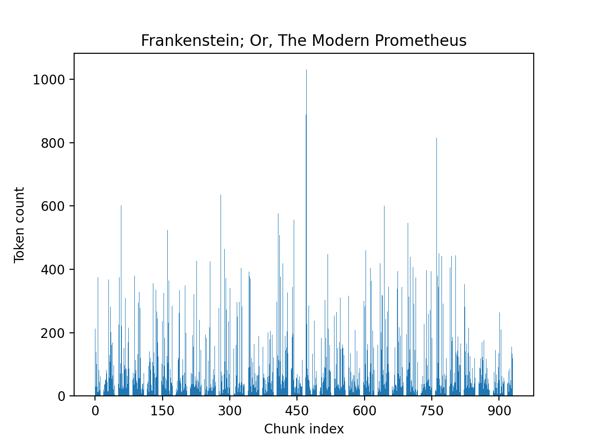
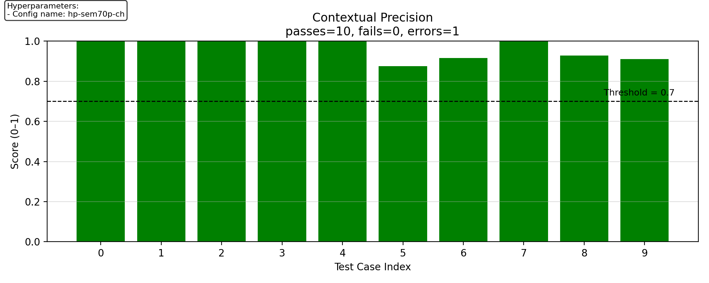
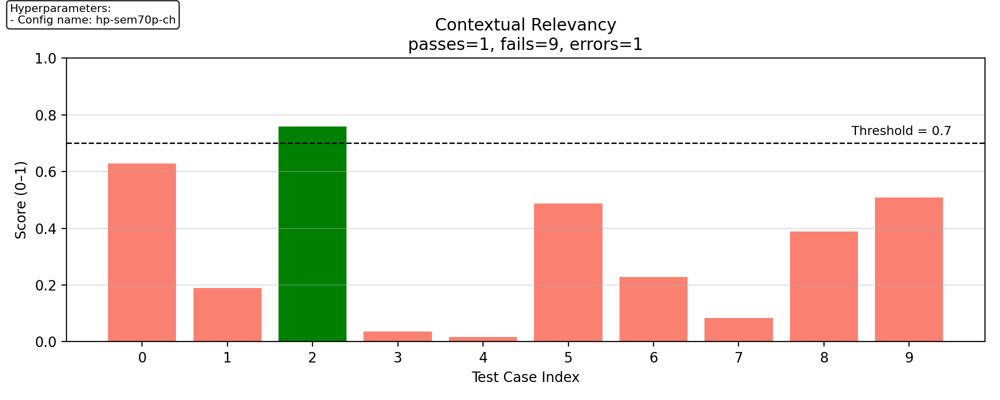

# Chunking
To ensure the quality of the retrieved context, 2 different approaches were experimented with: 
- Fixed size chunking
- Semantic sized chunking *(current)*

## Fixed size chunking
A simple but naive way to chunk, is to split up the book text by some hard defined word length. \
In this case about every 500 characters with `\n` as separator and an overlap between the chunks of 100 to keep some context from the previous chunk.

*Example of a fixed size chunk*\


**Evaluation results - Fixed size chunking (500 characters)**\
Having plotted the scores from running the [CI golden set](../evals/datasets/gb_ci_pipeline.csv) with DeepEval, it's clear that the chunks retrieved had "varying" relevance.. *yikes*\


On the other hand, answer generation went fine:\


From inspecting some of the test cases, we see that at e.g. index 7, with *Which musical instrument does Holmes play?*, the response was *"I dont know based on the given context"*.

This is the instructed default answer when no relevant context was given. Checking the context chunks, it's indeed true, there were no relevant mention of music or instruments:

**Snippet of test case 7**
```json
"name": "test_gutenberg_rag_answer_relevancy[test_case7]",
                "input": "Which musical instrument does Holmes play?",
                "actualOutput": "I dont know based on the given context.",
                "expectedOutput": "The violin",
                "retrievalContext": [
                    "gently waving his long, thin fingers in time to the music, while his\r\ngently smiling face and his languid, dreamy eyes were as unlike those\r\nof Holmes the sleuth-hound, Holmes the relentless, keen-witted,\r\nready-handed criminal agent, as it was possible to conceive. In his\r\nsingular character the dual nature alternately asserted itself, and his",

                    "you that he is at the head of his profession. It is past ten, however,\r\nand quite time that we started. If you two will take the first hansom,\r\nWatson and I will follow in the second.\u201d\r\n\r\nSherlock Holmes was not very communicative during the long drive and\r\nlay back in the cab humming the tunes which he had heard in the\r\nafternoon. We rattled through an endless labyrinth of gas-lit streets",

                    "audible\u2014a very gentle, soothing sound, like that of a small jet of\r\nsteam escaping continually from a kettle. The instant that we heard it,\r\nHolmes sprang from the bed, struck a match, and lashed furiously with\r\nhis cane at the bell-pull.\r\n\r\n\u201cYou see it, Watson?\u201d he yelled. \u201cYou see it?\u201d\r\n\r\nBut I saw nothing. At the moment when Holmes struck the light I heard a",

                    "writes upon Bohemian paper and prefers wearing a mask to showing his\r\nface. And here he comes, if I am not mistaken, to resolve all our\r\ndoubts.\u201d\r\n\r\nAs he spoke there was the sharp sound of horses\u2019 hoofs and grating\r\nwheels against the curb, followed by a sharp pull at the bell. Holmes\r\nwhistled.\r\n\r\n\u201cA pair, by the sound,\u201d said he. \u201cYes,\u201d he continued, glancing out of"
                    ...
                ],
```
[The full evaluation](../docs/doc_plots/3112-2025_1424_31-12-2025_1438/.latest_test_run.json)

**NB**
* *The evaluation scores can be seen at the bottom, under `metricScores`* [here](../docs/doc_plots/3112-2025_1424_31-12-2025_1438/.latest_test_run.json)
* *I've defined the threshold as 0.7, which is subjective. However from experience, this was the quality that semeed satisfying*
* *Devils advocate - in the evaluation above I used 4 chunks as the retrieval context, a higher number of retrieved chunks could also be experimented with, however from experience this didn't seem to matter*


## Semantic sized chunking
From the poor evaluation score above, more work was needed on the retrieval.\
Even with overlap between the chunks, context are easily lost when using fixed chunk sizes.\
With semantic chunking, chunks are split based on their meaning, in turn making each chunk more relevant.\
This produces chunks with varying lengths, and requires use of an embedding model while building the collection.\
This implementation uses a custom made splitter, with the [Semantic splitter by LlamaIndex](https://developers.llamaindex.ai/python/framework-api-reference/node_parsers/semantic_splitter/) as the base.

In brief, the splitter works roughly by:
1. Splitting the document into small base units (often sentences).
2. Make embeddings of each sentence.
3. For every sentence, compute semantic dissimilarity between it and its adjacent sentence (using cosine distance).
4. Collect all these distances and make a distribution
4. Define a `cutoff` based on the distribution and the breakpoint percentile threshold parameter.
5. Loop over all sentences, and insert a breakpoint only when the dissimilarity is > `cutoff`.

**Example of how the threshold is used:**\
Say we're given the sentences:
```markdown
S1: Holmes lit his pipe.
S2: He considered the evidence carefully.
S3: The fog lay thick over Baker Street.
S4: Meanwhile, in Paris, the minister resigned.
```
And their distances are
```markdown
S1–S2: 0.06
S2–S3: 0.08
S3–S4: 0.42   ← semantic jump
```
So if the cutoff is `0.3`:
* Sentences 1–3 → one chunk
* Sentence 4 → new chunk


However the distribution of the chunk lengths were very unenven. This is seen when inspecting two of the ten books charts created by the ingestion pipeline, *Alice's Adventure in Wonderland* and *Frankenstein*. They were generated with the default `cutoff` parameter of 95th percentile :\
 

The main disadvantages of having few but very long/uneven chunks are:
- **Bias**: longer chunks can dominate, since they are more "matchable" due their length.
- **Cost/latency**: With the reranker + generation over large contexts, it gets slower and more expensive.
- **Answer quality drift**: long chunks can make topics/meaning too "bland", increasing hallucination risk 

To level out the distribution better, I've experimented with a `cutoff` of 75th percentile dissimilarity, in turn returning smaller spikes but a lot more chunks:\
 

*NB:* I use the simplified term `cutoff` here, but the technical term is *breakpoint percentile threshold*. 


### Summary of the vector collection produced by semantic chnking
To better understand how the semantic splitting is applied on the whole collection, \
I've made a statistics summary of it, that is generated after the ingestion pipeline has populated the collection. The summary helps show how the chunk sizes are distributed. Here `std` is the standard deviation and `p` is the percentile, so `p90` is "90th percentile". \
There are three scopes to look at when investigating the entire collection. 
1. How many chunks each book produces - `book_chunk`
2. Insights, across books. The chunk sizes (token count) grouped by book - `book_chunk_sizes`
3. Chunk sizes across the entire collection (all chunks pooled together)

Comparing the 70th and 90th percentile side-by-side at each scope, with key insights underneath each table:

| Metric                         | 90th p   | 70th p |
| ------------------------------ | -------: | -------: |
| `config_id_used`               |        3 |        4 |
| `book_count`                   |       10 |       10 |
| `total_chunks` in collection   |    4,204 |   12,583 |
| `book_chunk_count_median`      |    349.5 |  1,045.0 |
| `book_chunk_count_p90`         |    737.0 |  2,207.9 |

Here `book_chunk_count` is the number of the chunks in a book.
* There are way more chunks in config 4!
* From the median and `p90`, config 4 is more granular/uses a finer segmentation

💡With config 4, having more chunks the retrieval "surface" is larger and should increase the recall (actually getting the correct info into the context). On the other hand, means having to store more embeddings and maybe increasing latency when retrieving from the vector DB.

| Metric                         | 90th p   | 70th p |
| ------------------------------ | -------: | -------: |
| `book_chunk_sizes_mean_median` |   310.71 |   104.42 |
| `book_chunk_sizes_mean_p90`    |   378.72 |   127.30 |
| `book_chunk_sizes_std_median`  |   435.72 |   141.00 |
| `book_chunk_sizes_std_p90`     |   509.13 |   190.90 |
| `book_chunk_sizes_max_median`  |  2,614.0 |  1,302.5 |
| `book_chunk_sizes_max_p90`     |  5,053.8 |  1,737.1 |

Here `book_chunk_sizes_mean_median` is the median of all the mean chunk sizes (token counts) of all the books. Similar goes for `_mean_p90`.

* The median of the `std` of all the books, shows that config 3 is highly unstable (i.e. values are very spread out from the mean) and config 4 the opposite. 

💡In practice, this mean that config 4 has more consisten chunk sizes across its collection.
* A 5k-token/chunk size is a bit of a red flag, since it will: 
- dominate the prompt in the answer generation, in turn pushing other contexts.
- often contains many unrelated concepts, making its topic/semantic meaning more bland


| Metric                         | 90th p   | 70th p |
| ------------------------------ | -------: | -------: |
| `config_id_used`               |        3 |        4 |
| `chunk_token_sizes_p10`        |     11.0 |      9.0 |
| `chunk_token_sizes_median`     |    151.0 |     44.0 |
| `chunk_token_sizes_p90`        |    815.0 |    278.0 |
| `chunk_token_sizes_p99`        | 2,115.88 |   798.18 |

* From the `median` we see that it has 151 token and 44 tokens on 70th percentile. A similar large difference is seen on the rest of the `chunk_token_count` rows. 
💡 Especially from the tails (`p90`and `p99`) it's clear that config 4 aggressively caps chunk growth. 

In conclusion, the more stable choice for retrieval would be to go with config 4 using the 70th percentile threshold.

ℹ️ All tables are from the .json stats-files in the `stats\index_stats\` folder.

**Eval score charts with semantic chunking using 70th percentile threshold**



Big improvement in the precision, now far better than the fixed size chunking. But as you would expect with very large, more bland chunks, the scores are still low for relevance. 

### Further experiments and findings *(Work in progress)*
One of the interesting challenges with works in long book form, is how they can be quite implicit and wordy, making such
sections i.e. chunks, harder to use for more explicit who-what-where questions. Or when the answer to a question requires *multi-hopping* combining multiple chunks located at different places in the work and jointly reasoning over them all.

For example in *Sherlock Holmes*, from the eval golden set `gb_gold_med.csv` the question *"Which character hires Holmes to investigate the strange advertisement seeking red-headed men?"* is non-trivial to answer for the system. 

